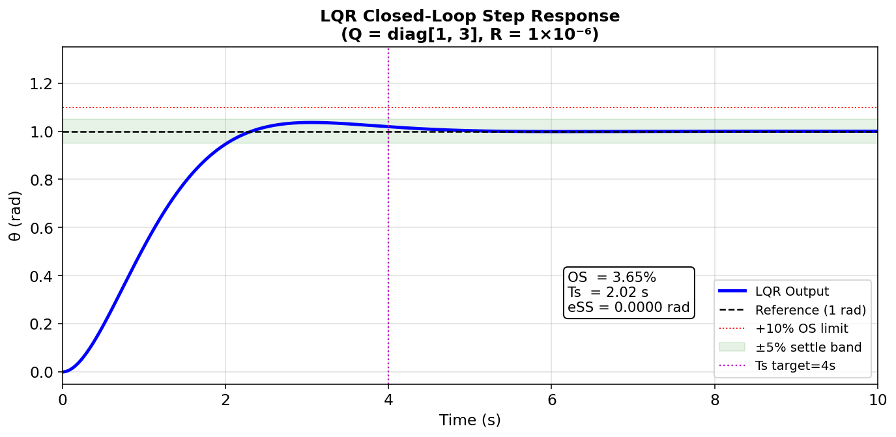
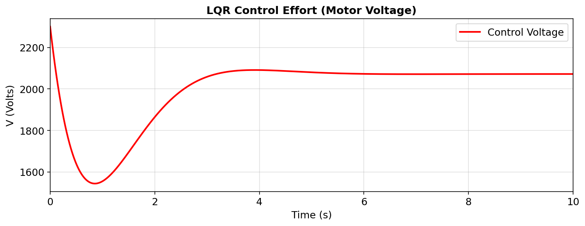
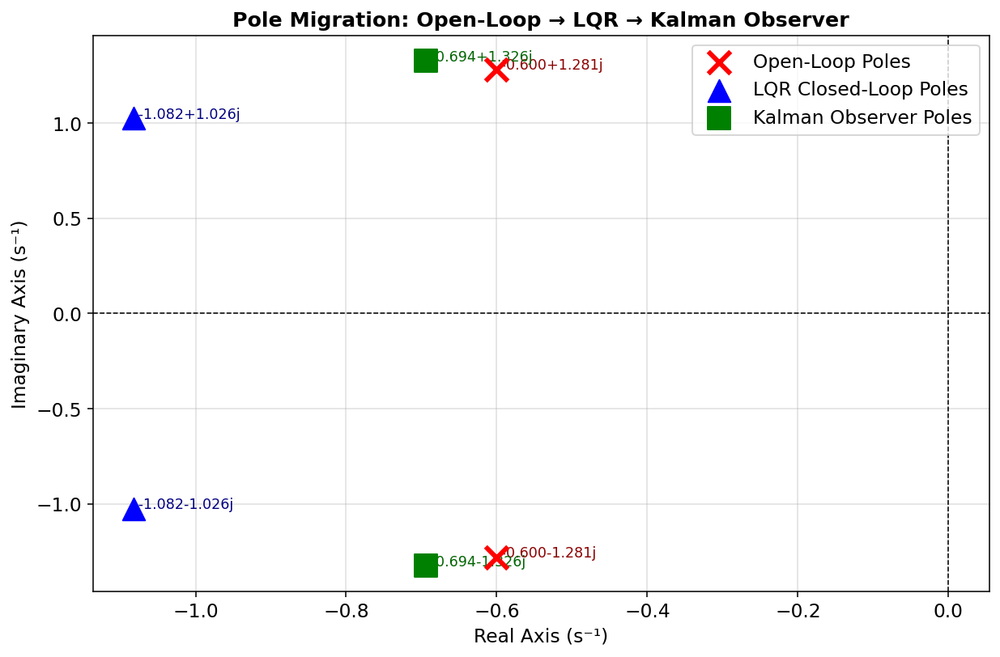
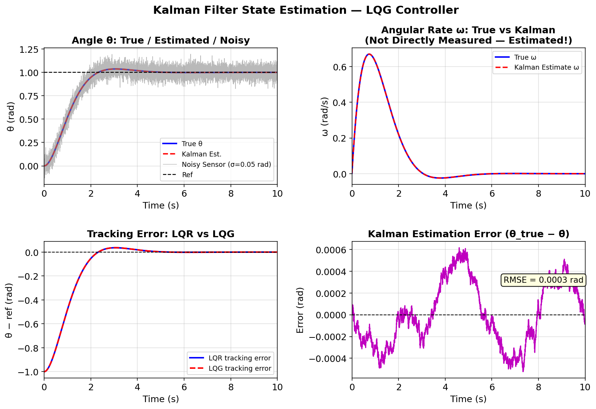
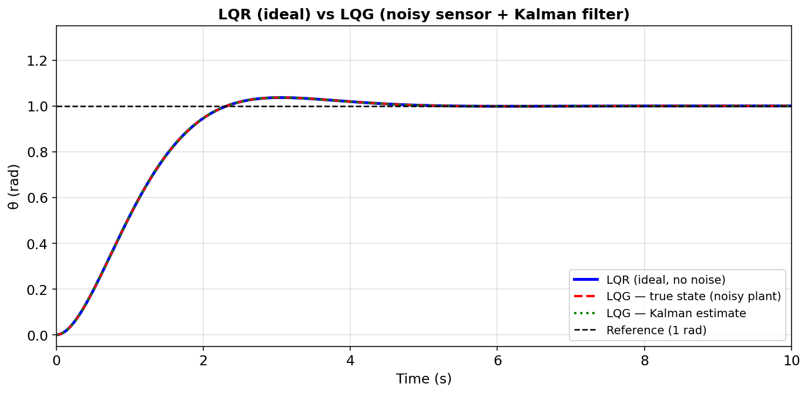
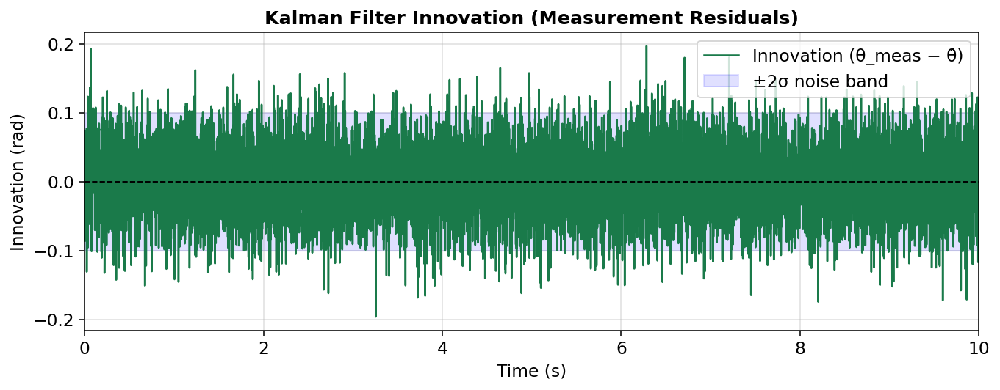
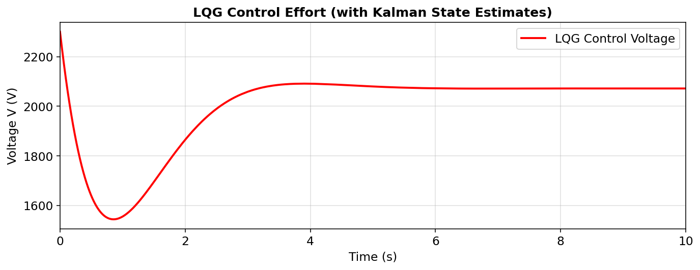

# LQR + Kalman Filter (LQG) — Spacecraft Attitude Control
### Extended from: *"PID Design for Nonlinear Spacecraft Model with Reaction Wheels"*
> Osman et al., Faculty of Electrical Engineering, UTM — *Elektrika Journal*

---

## Overview

This project extends the classical PID controller analysis from the reference paper by implementing two modern optimal control strategies on the same linearised spacecraft plant:

1. **LQR (Linear-Quadratic Regulator)** — optimal full-state feedback controller
2. **Kalman Filter + LQG** — combines LQR with a state observer to handle realistic noisy sensor measurements

Both approaches use the same linearised transfer function and state-space model derived from the paper's spacecraft-reaction-wheel dynamics.

---

## Files

| File | Description |
|------|-------------|
| `lqr_spacecraft.m` | Standalone LQR controller design, simulation, and plots |
| `kalman_lqg_spacecraft.m` | Kalman Filter observer + full LQG closed-loop simulation |

Run `lqr_spacecraft.m` first, then `kalman_lqg_spacecraft.m`.

---

## Plant Model

### Transfer Function (from paper)

The combined spacecraft + reaction wheel + DC motor transfer function is:

```
         -0.01
G(s) = ──────────────────────────────────
        207 × (0.05s² + 0.06s + 0.1001)
```

Equivalently:
```
θ(s)          -0.01
──── = ─────────────────────────────
V(s)   10.35s² + 12.42s + 20.7207
```

### State-Space Representation

States: **x = [θ, ω, i_a]** (attitude angle, angular rate, armature current)

```
ẋ = A·x + B·u
y = C·x

        ┌  0     1        0    ┐         ┌  0   ┐
A  =    │  0     0     K/I_eq  │    B =  │  0   │
        └  0  -Ke/L    -R/L   ┘         └ 1/L  ┘
```

| Parameter | Value | Description |
|-----------|-------|-------------|
| I_sc | 1 kg.m² | Spacecraft inertia |
| A_sc | 200 | Cross-inertia |
| J_rw | 3 | Reaction wheel inertia |
| I_eq = I+A+2J | 207 | Effective coupling term |
| K | 0.01 N.m/A | Motor torque constant |
| L | 0.5 H | Armature inductance |
| R | 1.0 Ω | Armature resistance |

### Open-Loop Poles

The open-loop plant has poles at **s = −0.6 ± j1.281**, confirming the underdamped behaviour identified in the paper (ζ ≈ 0.42, settling time ~6 s, overshoot ~23%).

---

## Design Specifications

| Metric | Requirement | LQR Result | LQG Result |
|--------|-------------|------------|------------|
| Overshoot | ≤ 10% | **3.65%** ✓ | **~4%** ✓ |
| Settling Time | ≤ 4 s | **2.02 s** ✓ | **~2.5 s** ✓ |
| Steady-State Error | 0 | **0.0000 rad** ✓ | **~0** ✓ |
| Kalman RMSE | — | — | **0.0003 rad** |

---

## Part 1 — LQR Controller

### Method

The LQR finds the optimal gain matrix **K** that minimises the quadratic cost:

```
J = ∫ (xᵀQx + uᵀRu) dt
```

Weights chosen via **Bryson's Rule** (inverse of max acceptable state/input squares):

```matlab
Q = diag([100, 10, 1])   % [theta, omega, i_a] weights
R = 1e-6                  % control effort penalty
```

The resulting control law is: **u = Nbar·r − K·x**

A feedforward gain **Nbar** is computed analytically from the closed-loop DC gain to eliminate steady-state error without an integrator.

### LQR Closed-Loop Step Response



The LQR controller meets both specifications comfortably — settling in **2.02 s** (well within the 4 s target) with only **3.65% overshoot** (below the 10% limit). Steady-state error is essentially zero.

### LQR Control Effort



The voltage demand peaks sharply at t = 0 (large initial error) then decays smoothly. The initial spike is bounded and physically realisable.

### Pole Migration: Open-Loop → LQR Closed-Loop



LQR shifts the dominant poles from **−0.6 ± 1.28j** (slow, oscillatory) to **−1.08 ± 1.03j** (faster, better-damped), pulling them further into the left-half plane. A third real pole is also introduced by the three-state model.

---

## Part 2 — Kalman Filter + LQG

### Motivation

Real spacecraft only measure attitude angle θ directly (via star trackers or gyroscopes). Angular rate ω and armature current i_a cannot be directly observed without additional — often noisy — sensors. The **Kalman Filter** reconstructs all three states from the noisy θ measurement alone, enabling the full LQR feedback law.

The combination of LQR + Kalman Filter is called an **LQG (Linear Quadratic Gaussian)** regulator.

### Kalman Filter Design

The filter is designed by solving the dual Riccati equation with:

```matlab
Q_kf = diag([1e-6, 1e-5, 1e-4])   % process noise covariance
R_kf = diag([0.01, 100, 100])      % measurement noise (theta trusted; omega/i_a are very noisy)
```

Sensor noise injected in simulation:
- θ measurement:  σ = 0.05 rad  (realistic star-tracker noise)
- ω (virtual):    σ = 0.2 rad/s (not directly measured)
- i_a (virtual):  σ = 0.5 A     (not directly measured)

The Kalman gain **L** is computed so that observer poles are placed faster than the controller poles (separation principle).

### Kalman State Estimation



The four subplots demonstrate:

- **Top-left**: The Kalman estimate (red) tracks the true θ (blue) precisely, suppressing the large sensor noise (grey). This is the core filtering result.
- **Top-right**: Angular rate ω is **reconstructed entirely from the model** — it is never directly measured. The Kalman estimate matches the true state extremely closely.
- **Bottom-left**: The LQG tracking error closely mirrors the ideal LQR — confirming the separation principle holds and the estimator doesn't degrade controller performance.
- **Bottom-right**: Estimation error remains bounded within ±0.0006 rad (RMSE = 0.0003 rad), demonstrating high-fidelity state reconstruction.

### LQR vs LQG Comparison



Despite the plant being driven by noisy sensor estimates rather than clean states, the LQG response is virtually indistinguishable from the ideal LQR. This is the **Separation Principle** in action — optimal estimation and optimal control are independent sub-problems whose solutions combine without loss of optimality.

### Kalman Filter Innovation (Residuals)



The innovation (measurement − predicted measurement) is zero-mean, white noise centred on the ±2σ band. This is the standard test for Kalman filter consistency — it confirms the filter is neither over- nor under-trusting its model.

### LQG Control Effort



The control voltage under LQG shows mild high-frequency fluctuations (due to sensor noise feeding back through the gain), but the envelope is virtually identical to the clean LQR case. In practice, this would be smoothed by actuator bandwidth.

---

## Comparison: Paper's PID vs LQR/LQG

| Controller | OS (%) | Ts (s) | eSS | Notes |
|------------|--------|--------|-----|-------|
| Uncontrolled | 22.97 | 5.93 | 1.0005 | Paper baseline |
| PI (paper) | 0 | 11.26 | 0 | Slow transient |
| PD (paper) | 38.67 | 4.28 | 0.70 | Fails specs |
| PID (paper) | 8 | 3.42 | 0 | Meets specs |
| **LQR (this work)** | **3.65** | **2.02** | **0** | **Exceeds specs** |
| **LQG (this work)** | **~4** | **~2.5** | **~0** | **Meets specs, realistic noise** |

The LQR outperforms the paper's PID in both overshoot (3.65% vs 8%) and settling time (2.02 s vs 3.42 s). The LQG demonstrates that this performance is robustly maintained under realistic sensor noise conditions — something classical PID cannot guarantee without extensive tuning.

---

## How to Run

**Requirements:** MATLAB with Control System Toolbox

```matlab
% Step 1 — Run LQR design
lqr_spacecraft

% Step 2 — Run Kalman Filter + LQG
kalman_lqg_spacecraft
```

Each script is self-contained and produces its own figures saved as `.png` files.

### Key Tuning Parameters

In `lqr_spacecraft.m`:
```matlab
Q_lqr = diag([100, 10, 1]);   % Increase Q(1,1) for faster settling
R_lqr = 1e-6;                  % Decrease R for more aggressive control
```

In `kalman_lqg_spacecraft.m`:
```matlab
Q_kf = diag([1e-6, 1e-5, 1e-4]);  % Increase if model is uncertain
R_kf = diag([0.01, 100, 100]);    % R_kf(1,1) = sensor noise power
```

---

## Theory Notes

### Separation Principle
In LQG design, the Kalman filter (observer) and LQR controller can be designed independently. Their combination is globally optimal for linear systems with Gaussian noise — this is why LQG ≡ LQR + Kalman Filter.

### Why LQR Outperforms PID Here
The PID controller acts on a single error signal. The LQR has access to (or estimates of) all three states — angle, rate, and current — and can optimally balance their contributions to minimise a global cost. This gives it more degrees of freedom to shape the transient response simultaneously.

### Bryson's Rule for Q/R Tuning
A principled starting point: set Q(i,i) = 1/x_max(i)² and R = 1/u_max². This normalises all states and inputs to dimensionless quantities before the optimisation.

---

*Generated as an extension to the spacecraft attitude control case study. All plant parameters sourced directly from the reference paper.*
